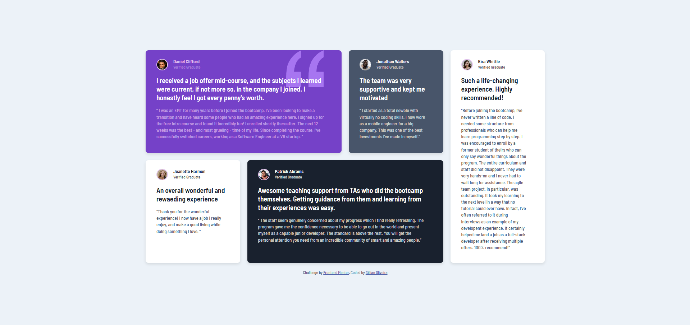

# Frontend Mentor - Testimonials grid section solution

This is a solution to the [Testimonials grid section challenge on Frontend Mentor](https://www.frontendmentor.io/challenges/testimonials-grid-section-Nnw6J7Un7). Frontend Mentor challenges help you improve your coding skills by building realistic projects.

## Table of contents

- [Frontend Mentor - Testimonials grid section solution](#frontend-mentor---testimonials-grid-section-solution)
  - [Table of contents](#table-of-contents)
  - [Overview](#overview)
    - [The challenge](#the-challenge)
    - [Screenshot](#screenshot)
    - [Links](#links)
  - [My process](#my-process)
    - [Built with](#built-with)
    - [What I learned](#what-i-learned)
    - [Continued development](#continued-development)
    - [Useful resources](#useful-resources)
  - [Author](#author)
  - [Acknowledgments](#acknowledgments)

**Note: Delete this note and update the table of contents based on what sections you keep.**

## Overview

### The challenge

Users should be able to:

- View the optimal layout for the site depending on their device's screen size

### Screenshot
Preview:


My solution:



### Links

- Solution URL: [Testimonials Grid Repo](https://github.com/lia-oliveira/testimonials-grid-section)
- Live Site URL: [Testimonials Grid Live Solution](https://testimonials-grid-section-eight-inky.vercel.app/)

## My process

### Built with

- Semantic HTML5 markup
- CSS custom properties
- Flexbox
- CSS Grid
- Mobile-first workflow


### What I learned
1 - One of the most important lessons I learned from this project was working with measurements based on multiples of 10. I had used this technique before, but I believe I now truly understand how much easier it makes things. It involves setting the HTML font size to a percentage equivalent to ten pixels. From there, 10px = 1rem, so to apply, for example, 13px, you just use 1.3rem. After that, the work flowed much faster, and the results were more precise.

```css
html {
    font-size: 62.5%;
}
```

2 -I learned how to change the color of .svg via CSS.
```css

.card-header__icon[data-icon="quotation"] {
    ...
    fill: var(--co-primary-03-light-pink-70);
    ...
}
```

### Continued development

I need to learn more about shadows and how to name classes using BEM. I think I not only need to work on more projects or watch more tutorials but also to see other people's solutions.

### Useful resources

The main resources I used were:


- [Origamid's Complete CSS Grid Guide](https://www.origamid.com/projetos/css-grid-layout-guia-completo/) - It helps me recall property names and their purposes. It's an excellent quick-reference guide.
- [Origamid's Complete CSS Flexbox Guide](https://origamid.com/projetos/flexbox-guia-completo/) - For the same reasons I chose the CSS Grid guide.
- [Cesar Lopes’ blog post on "How to Change SVG Color with CSS"](https://www.cesarlopes.com/site/como-alterar-a-cor-de-um-svg-com-css/) - I learned how to change SVG colors via CSS.
- [CSS Tricks’ Complete Guide to Grid](https://css-tricks.com/snippets/css/complete-guide-grid/) - Also great for quick references and solving specific CSS Grid doubts.
- [CSS Grid Layout da Mozila](https://developer.mozilla.org/en-US/docs/Web/CSS/CSS_grid_layout/Basic_concepts_of_grid_layout) - I’m reading it to improve my understanding of Grid and to do better in future projects.


## Author

- Website - [Gillian Oliveira](https://github.com/lia-oliveira)
- Frontend Mentor - [@lia-oliveira](https://www.frontendmentor.io/profile/lia-oliveira)
- X - [@byliaoliveira](https://x.com/byliaoliveira) 🚧


## Acknowledgments

Thank you to my colleagues [@AdrianoEscarabote](https://www.frontendmentor.io/profile/AdrianoEscarabote), [@R3ygoski](https://www.frontendmentor.io/profile/R3ygoski), and [@damigand](https://www.frontendmentor.io/profile/damigand) for the time spent analyzing and contributing to the improvement of the Four card feature section solution. Your valuable insights have made this project better than it would have been originally.

